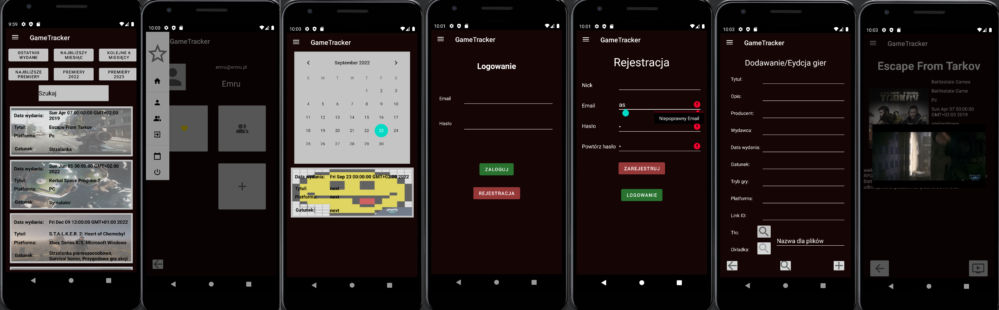
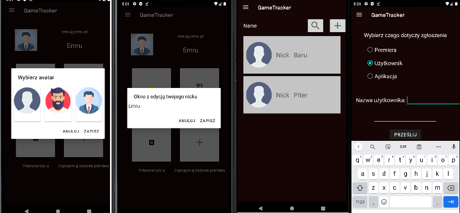
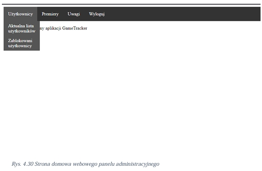
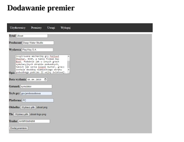
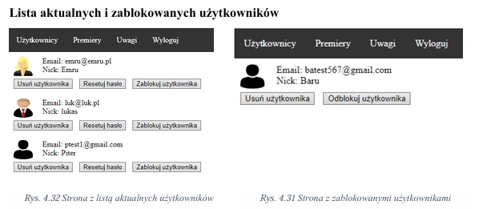

# 🎮 GameTracker

Aplikacja mobilna do **śledzenia premier gier** z elementami społecznościowymi. Napisana na Androida (Java) z backendem w Firebase. Zawiera również **webowy panel administracyjny** do zarządzania premierami i użytkownikami.

## 📱 Funkcje aplikacji mobilnej

- Przeglądanie premier gier (przyszłych i przeszłych)
- Wyszukiwanie premier po tytule, dacie lub gatunku
- Szczegóły gry: opis, zwiastun, wydawca, platformy
- Dodawanie premier do listy ulubionych
- Kalendarz premier
- Konto użytkownika z awatarem i edytowalnym nickiem
- Lista znajomych + rekomendacje na podstawie wspólnych gatunków
- System zgłoszeń i propozycji nowych premier
- Rekomendacje gier na podstawie ulubionych gatunków

## 🛠️ Stack technologiczny

- **Android** (Java, XML, Android Studio)
- **Firebase** (Authentication, Firestore, Storage)
- **HTML + JavaScript (ES6)** – panel administracyjny
- **Figma** – projektowanie UI
- **YouTube Android Player API** – zwiastuny gier

## 🖥️ Panel administracyjny

- Logowanie z autoryzacją Firebase
- Zarządzanie użytkownikami (blokowanie, resetowanie hasła)
- Zarządzanie premierami (dodawanie, edycja, zatwierdzanie, usuwanie)
- Obsługa zgłoszeń od użytkowników

## 📷 Zrzuty ekranu

| Aplikacja mobilna | Panel administracyjny |
|-------------------|------------------------|
|  |  |

© Łukasz Wojciechowski, 2025

Ten projekt został stworzony jako praca inżynierska i służy wyłącznie jako prezentacja umiejętności autora (portfolio).

Kopiowanie, rozpowszechnianie, modyfikowanie lub wykorzystywanie fragmentów kodu bez wyraźnej pisemnej zgody autora jest zabronione.

Wszelkie prawa zastrzeżone.
